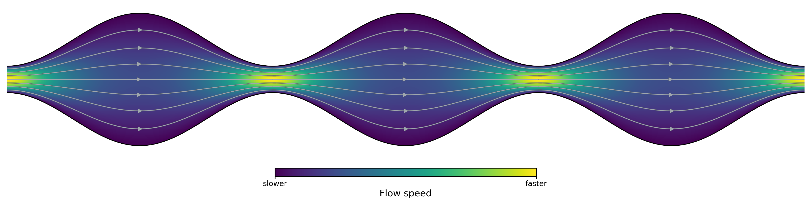
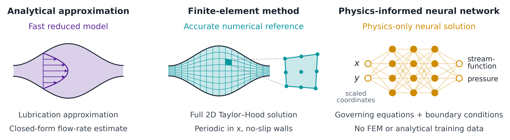

# Corrugated-channel Stokes flow: Finite elements and physics-informed neural networks

### Analytical approximation · Finite-element method · Physics-informed neural networks


<p align="center">
  
  <br>
  <em>Pressure-driven Stokes flow in the periodically corrugated channel. <br> The single-period solution is repeated over three periods for visualization.</em>
</p>

## Problem

This project studies pressure-driven incompressible flow through a periodically corrugated channel in the Stokes limit, corresponding to Reynolds number $Re=0$. The aim is to treat the same physical problem at three complementary levels: an analytical approximation, a full two-dimensional solution obtained with the finite-element method (FEM), and a physics-informed neural network (PINN).

<p align="center">
  
  <br>
  <em>Same physical problem, three complementary solution approaches.</em>
</p>

PINNs have already been applied to a broad range of computational fluid dynamics (CFD) problems, including flows in non-trivial geometries. Here the purpose is to isolate periodic corrugation as the main numerical complication. Curved no-slip walls, strong variation of the channel width, and periodicity require accurate geometry handling and make scaling, near-wall collocation, and boundary enforcement especially important for the PINN. The Stokes limit removes inertial nonlinearity, so these geometry-related issues can be examined in a minimal, controlled setting. FEM provides an independent full-field numerical reference, while the analytical model supplies a reduced reference. This three-level framework can naturally be extended to finite-$`Re`$ Navier–Stokes flows.

For the channel geometry, I use the sinusoidally corrugated setup from my earlier study below, while focusing here on the pressure-driven flow itself:

S. Martens, A. V. Straube, G. Schmid, L. Schimansky-Geier, and P. Hänggi,
“Hydrodynamically Enforced Entropic Trapping of Brownian Particles,”
*Physical Review Letters* **110**, 010601 (2013),
[doi:10.1103/PhysRevLett.110.010601](https://doi.org/10.1103/PhysRevLett.110.010601).

<p align="center">
  
  <br>
  <em>Single periodic computational cell and geometric parameters.</em>
</p>

The target case uses $L=1$, $\Delta\Omega=0.5$, $\Delta\omega=0.1$, $\delta=0.2$, $\varepsilon=0.4$, $\mu=1$, and $\Delta p=-1$.

## Methods

- **Analytical approximation.** A leading-order lubrication model provides an
  interpretable reduced description and recovers the exact Poiseuille solution
  in the straight-channel limit.
- **Finite-element method (FEM).** A mapped $`Q_2`$–$`\,Q_1`$ Taylor–Hood formulation
  resolves the full two-dimensional Stokes problem with periodic boundary
  conditions and a pressure gauge.
- **Physics-informed neural network (PINN).** A float64
  streamfunction–pressure network is trained from the governing equations,
  no-slip wall conditions, and periodicity alone.

No FEM field, analytical field, or target flux enters PINN training. The FEM
solution is used only afterward as an independent post-training reference.

## Main results

The central numerical result is that a PINN trained from the governing
equations and boundary conditions alone closely reproduces an independently
computed FEM solution. This agreement is consistent across all three
initialization seeds.

### PINN vs FEM

The field visualization shows the preselected representative seed $1$ together
with the magnitude of its velocity difference from the FEM reference. The
quantitative summary below includes all three independently initialized PINNs.

<table>
  <tr>
    <td width="50%" align="center"><b>PINN solution — seed 1</b></td>
    <td width="50%" align="center"><b>Difference from FEM</b></td>
  </tr>
  <tr>
    <td align="center">
      
    </td>
    <td align="center">
      
    </td>
  </tr>
</table>

Across seeds $0$, $1$, and $2$:

| FEM–PINN discrepancy | Mean over 3 seeds | Std. over 3 seeds |
|---|---:|---:|
| Velocity | $0.258\%$ | $0.034\%$ |
| Zero-mean pressure | $0.138\%$ | $0.013\%$ |
| Mean flux | $0.077\%$ | $0.020\%$ |

The three-seed mean discrepancies are below $0.3\%$ for velocity, zero-mean
pressure, and mean flux. Every seed has a velocity discrepancy below $0.3\%$;
the maximum is approximately $0.295\%$.

### Analytical reference

For the target geometry, the leading-order lubrication approximation gives
$Q_{\mathrm{lub}}=4.23498\times10^{-4}$, compared with the
$256\times128$ FEM reference,
$Q_{\mathrm{FEM}}\approx3.85231\times10^{-4}$, a discrepancy of approximately
$9.93\%$.

The lubrication model therefore provides a transparent reduced reference, while
the two-dimensional FEM and PINN resolve the corrugated-channel flow directly.

The reported FEM–PINN differences are numerical discrepancies, not rigorous
error bounds.

## Detailed documentation

1. [Problem and geometry](docs/01_problem.md) — physical domain, equations,
   boundary conditions, and target parameters.
2. [Analytical approximation](docs/02_analytical.md) — exact Poiseuille limit,
   lubrication model, and its FEM-tested regime of validity.
3. [Finite-element method](docs/03_fem.md) — mapped Taylor–Hood formulation,
   periodic reduction, convergence, and reference fields.
4. [Physics-informed neural network](docs/04_pinn.md) — scaling, architecture,
   physics loss, deterministic collocation, and optimization histories.
5. [Post-training validation](docs/05_validation.md) — independent PINN
   diagnostics and the three-seed FEM–PINN comparison.

## Getting started

### Setup

The project was developed and tested with Python 3.12 and a CPU PyTorch build.
For a basic editable installation, run:

```text
python -m pip install -e .
```

To include the test dependencies, use the optional `test` dependency group:

```text
python -m pip install -e ".[test]"
```

### Included results

Completed analytical, FEM, PINN, validation, convergence, summary, and figure
outputs are included under `results/`; inspecting them does
not require retraining or rerunning the solvers.

- `results/` contains the stored results used by this README and
  the technical documentation.
- `reproduction/` is an optional local rerun tree, created on demand and
  ignored by Git.

`results/summary.json` collects the principal FEM reference quantities,
per-seed PINN training and validation metrics, and the aggregate three-seed
FEM–PINN comparison in one machine-readable file.

### Verify the repository

Run the inexpensive regression suite to check the workflow,
stored-result consistency, documentation links, and figure-generation
interfaces without rerunning the expensive scientific calculations:

```text
python -m pytest -q
```

## Reproducing the study

The completed results are included under `results/`. Commands without a
root-selection option read and write under the optional top-level
`reproduction/` tree, leaving `results/` unchanged. Use
`--canonical` to select `results/` explicitly, or `--results-root PATH` to use
another top-level result root. These selectors are mutually exclusive, and a
custom root cannot be `results/` or one of its descendants. This README and its
included scientific figures refer to `results/`.

Each script listed below exposes its available options with:

```text
python <script> --help
```

### Analytical and FEM

The analytical/FEM sweep, resolution check, FEM reference, and FEM convergence
study can be reproduced with:

```text
python scripts/run_analytical_fem_sweep.py
python scripts/check_analytical_fem_resolution.py
python scripts/generate_fem_reference.py
python scripts/run_fem_convergence.py
```

### PINN training and validation

Train the three deterministic initializations with:

```text
python scripts/train_pinn.py --seed 0
python scripts/train_pinn.py --seed 1
python scripts/train_pinn.py --seed 2
```

After training, run the separate post-training validation workflow for each seed:

```text
python scripts/validate_pinn.py --seed 0
python scripts/validate_pinn.py --seed 1
python scripts/validate_pinn.py --seed 2
```

### Post-processing and figures

Build the compact summary from the results in the selected root:

```text
python scripts/summarize_results.py
```

The focused figure scripts read stored results in that same root; they do not
retrain the PINNs or rerun FEM:

```text
python scripts/figures/problem.py
python scripts/figures/analytical.py
python scripts/figures/fem.py
python scripts/figures/pinn.py
python scripts/figures/validation.py
```

To operate explicitly on `results/`, use `--canonical`; for example:

```text
python scripts/figures/fem.py --canonical
python scripts/summarize_results.py --canonical
```

### Safe reruns

Calculation scripts do not silently overwrite existing results unless an
explicit script-specific overwrite or recovery option is used. Figure files
may be regenerated under the selected root. The optional `reproduction/` tree
may not exist until a rerun is performed.

On Windows, the scripts set conservative single-threaded MKL/OpenMP defaults
before numerical imports while preserving user-defined values. No
machine-specific Python path or shell is required.
