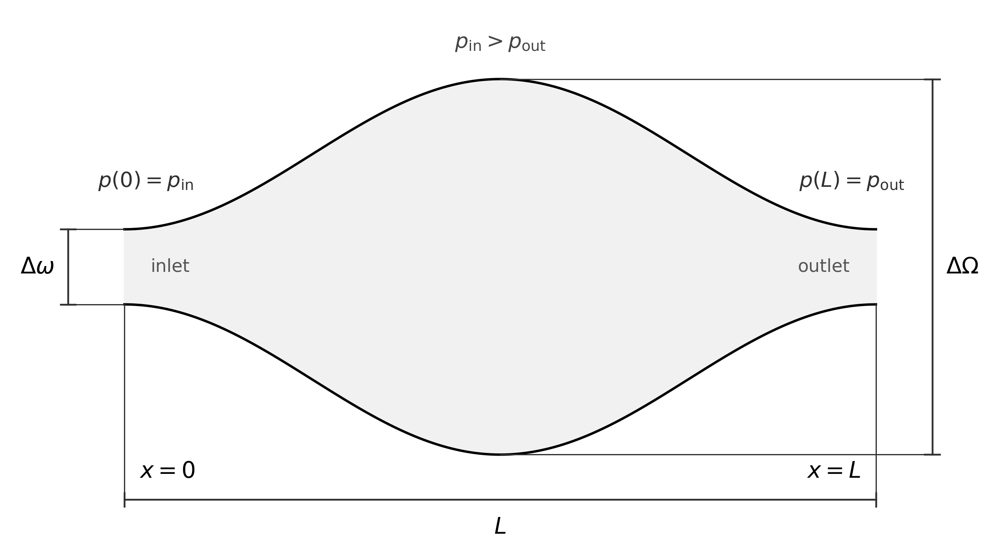

# Physical problem

This project considers steady pressure-driven incompressible Stokes flow through one periodic cell of a two-dimensional symmetric sinusoidally corrugated channel.

## Geometry and notation

The physical FEM cell is

$$
0 \le x \le L,
\qquad
\omega_-(x) \le y \le \omega_+(x),
$$

with full channel width

$$
H(x)=\omega_+(x)-\omega_-(x).
$$

The maximum and minimum full widths are denoted by $\Delta\Omega$ and $\Delta\omega$, respectively. Define

$$
H_0=\frac{\Delta\Omega+\Delta\omega}{2},
\qquad
A=\frac{\Delta\Omega-\Delta\omega}{2}.
$$

In the physical FEM coordinate convention used throughout the analytical and FEM parts,

$$
H(x)
=
H_0-A\cos\left(\frac{2\pi x}{L}\right),
$$

and the symmetric walls are

$$
\omega_\pm(x)=\pm\frac{H(x)}{2}.
$$

Thus the channel is narrowest at $x=0$ and $x=L$, and widest at $x=L/2$.

Two dimensionless geometric quantities are used in the project:

$$
\delta=\frac{\Delta\omega}{\Delta\Omega},
$$

the constriction ratio, and

$$
\varepsilon=\frac{\Delta\Omega-\Delta\omega}{L},
$$

the corrugation parameter used in the original physical notation. The PINN formulation introduces a different quantity, the relative amplitude $a=A/H_0$; it is deliberately kept distinct from $\varepsilon$.

  
   
  <em>Periodic sinusoidally corrugated channel geometry.</em>

## Pressure-driven Stokes equations

Let $p$ denote the physical pressure and introduce a periodic pressure correction $\widetilde p$ through

$$
p(x,y)=\widetilde p(x,y)-Gx,
\qquad
G=-\frac{\Delta p}{L}>0,
$$

where

$$
\Delta p=p(L,y)-p(0,y)<0.
$$

For velocity

$$
\mathbf u=(u,v),
$$

the steady incompressible Stokes equations in one periodic cell are

$$
-\mu\nabla^2u+\frac{\partial\widetilde p}{\partial x}=G,
$$

$$
-\mu\nabla^2v+\frac{\partial\widetilde p}{\partial y}=0,
$$

$$
\frac{\partial u}{\partial x}
+
\frac{\partial v}{\partial y}=0.
$$

Equivalently,

$$
-\mu\nabla^2\mathbf u+\nabla\widetilde p
=
G\,\mathbf e_x,
\qquad
\nabla\cdot\mathbf u=0.
$$

The formulation is at $Re=0$; no inertial term is present.

## Boundary conditions

The channel walls satisfy no slip,

$$
\mathbf u(x,\omega_\pm(x))=\mathbf 0.
$$

The velocity and periodic pressure correction are periodic across the cell,

$$
u(0,y)=u(L,y),
$$

$$
v(0,y)=v(L,y),
$$

$$
\widetilde p(0,y)=\widetilde p(L,y),
$$

for corresponding points on the two periodic boundaries.

Only pressure differences are physical, so $\widetilde p$ is determined up to an additive constant. The FEM formulation fixes this nullspace with one pressure gauge; field comparisons use a zero-mean pressure representative.

## Target case

The final FEM–PINN comparison uses the following physical parameters.

| Quantity | Definition | Value |
|---|:---:|---:|
| Period | $L$ | $1$ |
| Maximum full width | $\Delta\Omega$ | $0.5$ |
| Minimum full width | $\Delta\omega$ | $0.1$ |
| Constriction ratio | $\delta=\Delta\omega/\Delta\Omega$ | $0.2$ |
| Corrugation parameter | $\varepsilon=(\Delta\Omega-\Delta\omega)/L$ | $0.4$ |
| Mean full width | $H_0$ | $0.3$ |
| Width amplitude | $A$ | $0.2$ |
| Dynamic viscosity | $\mu$ | $1$ |
| Pressure change per cell | $\Delta p$ | $-1$ |
| Driving magnitude | $G=-\Delta p/L$ | $1$ |
| Reynolds number | $Re$ | $0$ |

The analytical approximation, FEM discretization, and PINN formulation all refer to this same physical problem. They differ in how the problem is represented and solved; those method-specific formulations are documented separately.
