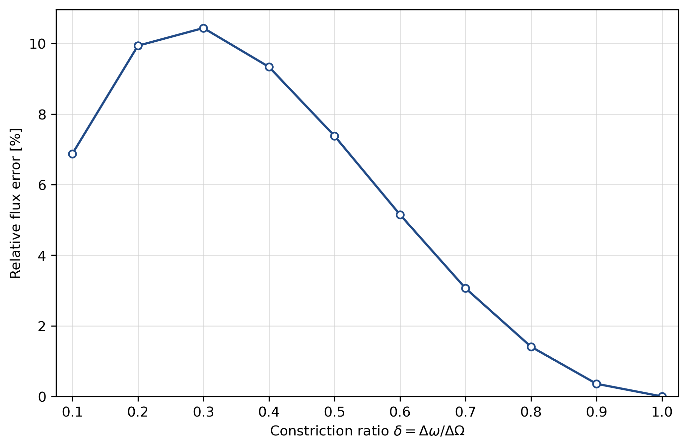

# Analytical reference

The analytical part of the project provides two reference solutions for the pressure-driven Stokes problem defined in [Physical problem](01_problem.md):

1. the exact Poiseuille solution for a straight channel;
2. a leading-order lubrication approximation for the sinusoidally corrugated channel.

The analytical model is used as a transparent baseline, not as a replacement for the full two-dimensional FEM or PINN solutions.

## Exact straight-channel limit

For a straight symmetric channel of constant full width $H$, the exact Stokes velocity profile is

$$
u_{\mathrm{P}}(y)
=
\frac{G}{2\mu}
\left(
\frac{H^2}{4}-y^2
\right),
$$

with

$$
v_{\mathrm{P}}=0.
$$

The corresponding two-dimensional volume flux per unit out-of-plane depth is

$$
Q_{\mathrm{P}}
=
\int_{-H/2}^{H/2} u_{\mathrm{P}}(y)\,dy
=
\frac{GH^3}{12\mu}.
$$

This straight-channel solution provides an exact limiting check for both the analytical implementation and the FEM solver.

For the sweep point $\delta=1$, the channel is straight with $H=0.5$. The analytical flux is

$$
Q_{\mathrm{P}}
=
1.04166666666667\times10^{-2},
$$

while the corresponding $256\times128$ fine-sweep FEM result is

$$
Q_{\mathrm{FEM}}
=
1.04166666666729\times10^{-2}.
$$

The relative FEM deviation from the exact Poiseuille flux is approximately $6.02\times10^{-13}$.

## Leading-order lubrication approximation

For the corrugated channel, write the full width as

$$
H(x)
=
H_0-A\cos\left(\frac{2\pi x}{L}\right)
=
H_0
\left[
1-a\cos\left(\frac{2\pi x}{L}\right)
\right],
$$

where

$$
a=\frac{A}{H_0}.
$$

Define the period average of a function $f(x)$ by

$$
\langle f\rangle_x
=
\frac{1}{L}
\int_0^L f(x)\,dx.
$$

The inverse-cube geometry factor used by the lubrication approximation is

$$
F
=
H_0^3
\left\langle
H(x)^{-3}
\right\rangle_x.
$$

For the sinusoidal width above, this average has the closed form

$$
F
=
\frac{2+a^2}
{2(1-a^2)^{5/2}}.
$$

The leading-order lubrication flux is then

$$
Q_{\mathrm{lub}}
=
\frac{G H_0^3}
{12\mu F}.
$$

The associated local axial velocity profile is parabolic across each section,

$$
u_{\mathrm{lub}}(x,y)
=
\frac{
6Q_{\mathrm{lub}}
\left[y-\omega_-(x)\right]
\left[\omega_+(x)-y\right]
}
{H(x)^3}.
$$

By construction,

$$
\int_{\omega_-(x)}^{\omega_+(x)}
u_{\mathrm{lub}}(x,y)\,dy
=
Q_{\mathrm{lub}},
$$

so the leading-order approximation carries the same flux through every cross-section.

Only this leading-order lubrication model is used in the present project. Higher-order lubrication corrections are outside the scope of the public computational comparison.

## Analytical/FEM validity study

To quantify the accuracy of the leading-order approximation away from the straight-channel limit, the project compares $Q_{\mathrm{lub}}$ with independently computed FEM fluxes over

$$
\delta
=
1.0,\ 0.9,\ 0.8,\ 0.7,\ 0.6,\ 0.5,\ 0.4,\ 0.3,\ 0.2,\ 0.1.
$$

The swept parameter is

$$
\delta
=
\frac{\Delta\omega}{\Delta\Omega},
$$

with the following quantities fixed throughout the study:

$$
L=1,
\qquad
\Delta\Omega=0.5,
\qquad
\mu=1,
\qquad
\Delta p=-1,
\qquad
Re=0.
$$

Thus

$$
\Delta\omega
=
\delta\,\Delta\Omega.
$$

The selected FEM reference for the target case $\delta=0.2$ and the ten FEM values in the analytical sweep use a $256\times128$ mapped Taylor–Hood mesh, integration order $6$, and flux quadrature order $64$.

The relative analytical/FEM flux error is defined as

$$
e_Q^{\mathrm{lub}}
=
\frac{
\left|Q_{\mathrm{lub}}-Q_{\mathrm{FEM}}\right|
}
{
\left|Q_{\mathrm{FEM}}\right|
}.
$$

The numerical sweep values used in the table and figure are stored in
`results/analytical_fem/sweep.json`. This published analytical sweep contains
all ten points computed on the refined $256\times128$ FEM mesh.

| $\delta$ | $\varepsilon$ | $Q_{\mathrm{lub}}$ | $Q_{\mathrm{FEM}}$ | $e_Q^{\mathrm{lub}}$ |
|---:|---:|---:|---:|---:|
| $1.0$ | $0.00$ | $1.04167\times10^{-2}$ | $1.04167\times10^{-2}$ | $6.02\times10^{-13}$ |
| $0.9$ | $0.05$ | $8.85700\times10^{-3}$ | $8.82539\times10^{-3}$ | $0.3582\%$ |
| $0.8$ | $0.10$ | $7.31638\times10^{-3}$ | $7.21469\times10^{-3}$ | $1.409\%$ |
| $0.7$ | $0.15$ | $5.82004\times10^{-3}$ | $5.64693\times10^{-3}$ | $3.066\%$ |
| $0.6$ | $0.20$ | $4.40112\times10^{-3}$ | $4.18552\times10^{-3}$ | $5.151\%$ |
| $0.5$ | $0.25$ | $3.10135\times10^{-3}$ | $2.88818\times10^{-3}$ | $7.381\%$ |
| $0.4$ | $0.30$ | $1.97027\times10^{-3}$ | $1.80206\times10^{-3}$ | $9.334\%$ |
| $0.3$ | $0.35$ | $1.06148\times10^{-3}$ | $9.61177\times10^{-4}$ | $10.44\%$ |
| $0.2$ | $0.40$ | $4.23498\times10^{-4}$ | $3.85231\times10^{-4}$ | $9.934\%$ |
| $0.1$ | $0.45$ | $8.15861\times10^{-5}$ | $7.63385\times10^{-5}$ | $6.874\%$ |

  
   
  <em>Relative lubrication/FEM flux error across the constriction-ratio sweep.</em>

## Observed trend

The leading-order approximation is exact in the straight-channel limit and loses accuracy as the channel becomes corrugated. Over the sampled family, the relative flux error rises to approximately $10.44\%$ at $\delta=0.3$, then decreases to approximately $9.93\%$ at $\delta=0.2$ and $6.87\%$ at $\delta=0.1$.

The non-monotone trend in the $256\times128$ fine sweep was checked for
mesh-resolution sensitivity with a separate complete $128\times64$ sweep.
All ten coarse points were recomputed and compared point by point with the
corresponding $256\times128$ fine-sweep FEM values using

$$
d_Q^{\mathrm{mesh}}
=
\frac{
\left|Q_{\mathrm{FEM}}^{256\times128}-Q_{\mathrm{FEM}}^{128\times64}\right|
}{
\left|Q_{\mathrm{FEM}}^{128\times64}\right|
}.
$$

Both resolutions place the largest sampled lubrication/FEM discrepancy at
$\delta=0.3$. The maximum relative $128\times64\to256\times128$ FEM flux
change across the sweep is approximately $0.155\%$ at $\delta=0.1$, so the
observed trend is robust with respect to this mesh refinement. These
coarse–fine differences are mesh-sensitivity indicators, not rigorous
continuum-error estimates. The supporting evidence is stored in
`results/analytical_fem/resolution_check.json`. The present project treats this as a verified numerical observation and does not assign a physical mechanism to the non-monotonicity.
