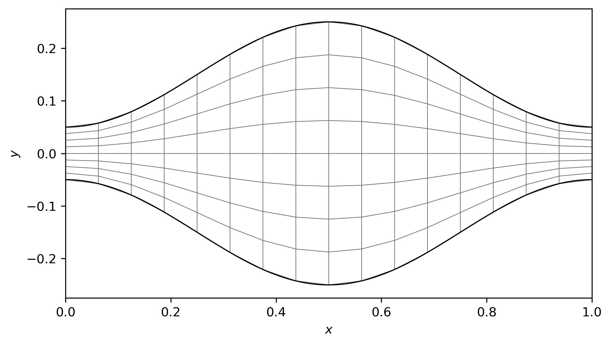
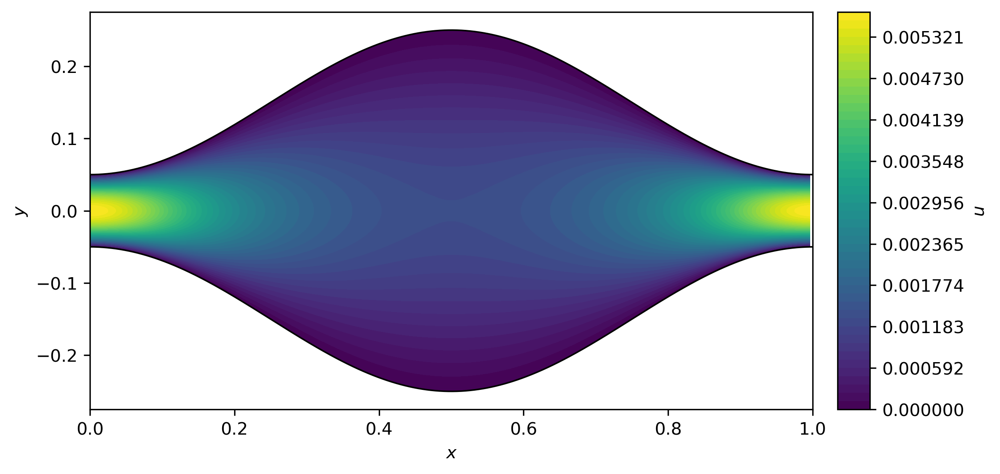
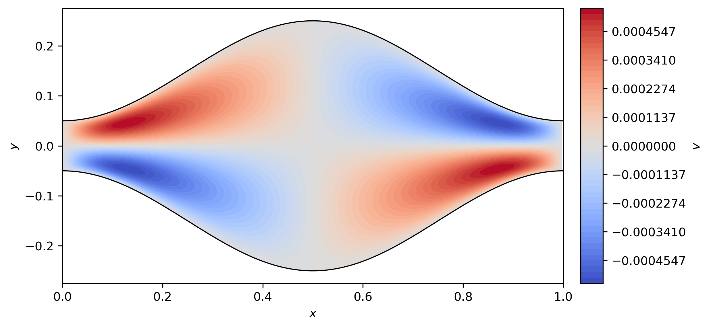
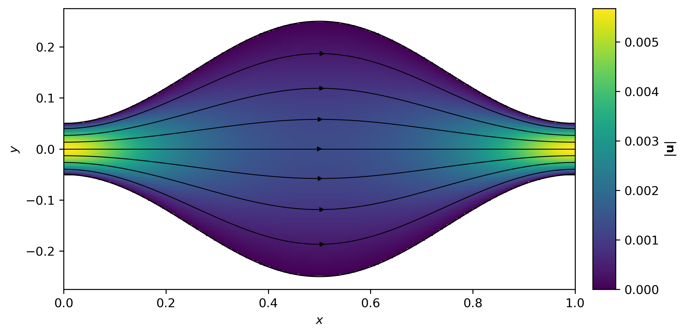
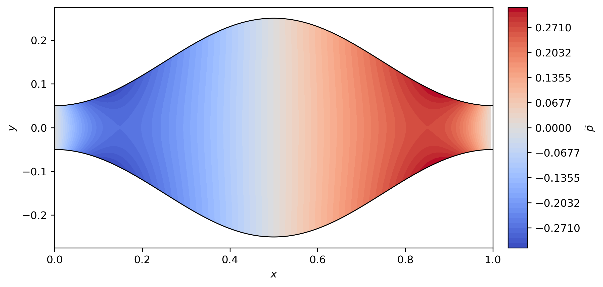

# Finite-element reference

This page documents the finite-element discretization and its numerical
verification. The common geometry, governing equations, and boundary
conditions are defined in [Physical problem](01_problem.md).

## Mapped quadrilateral mesh

The structured logical domain is

$$
0\le x\le L,
\qquad
-1\le\eta\le1.
$$

The reference-grid vertices are mapped to the physical channel by

$$
y(x,\eta)
=
\frac{1-\eta}{2}\,\omega_-(x)
+
\frac{1+\eta}{2}\,\omega_+(x).
$$

The resulting physical mesh is a structured quadrilateral mesh. Wall vertices
lie on the exact sinusoidal walls, while the FEM mesh represents each wall by
piecewise-linear segments between adjacent wall vertices.

For visualization, the figure below shows the coarse $16\times8$ level of the
refinement sequence, for which the mapped quadrilateral structure remains
clearly visible. The selected FEM reference uses the finer $256\times128$ mesh.

  
   
  <em>Illustrative 16×8 mapped quadrilateral mesh.</em>

## Taylor–Hood discretization

Velocity uses vector-valued biquadratic $Q_2$ elements and the periodic
pressure correction $\widetilde p$ uses bilinear $Q_1$ elements:

$$
\mathbf V_h=[Q_2]^2,
\qquad
Q_h=Q_1.
$$

The same quadrature order is used when constructing both spaces. The final
reference and convergence study use integration order $6$.

## Mixed weak form

Using the pressure decomposition already defined in the physical problem,

$$
p(x,y)=\widetilde p(x,y)-Gx,
$$

the discrete weak problem seeks $(\mathbf u_h,\widetilde p_h)\in\mathbf
V_h\times Q_h$ such that, for periodic test functions satisfying the wall
constraints,

$$
\mu\int_\Omega\nabla\mathbf u_h:\nabla\mathbf v_h\,d\Omega
-
\int_\Omega\widetilde p_h\,\nabla\cdot\mathbf v_h\,d\Omega
=
\int_\Omega G\,\mathbf e_x\cdot\mathbf v_h\,d\Omega,
$$

$$
\int_\Omega q_h\,\nabla\cdot\mathbf u_h\,d\Omega=0.
$$

Assembly gives the mixed block system

$$
\begin{pmatrix}
A&B^T\\
B&0
\end{pmatrix}
\begin{pmatrix}
U\\
P
\end{pmatrix}
=
\begin{pmatrix}
F\\
0
\end{pmatrix}.
$$

In the implementation, $A$ is the viscous vector-Laplacian block and
$B=-\operatorname{div}$ is the negative discrete divergence block.

## Periodicity, walls, and pressure gauge

Periodic degrees of freedom are paired at the left and right boundaries by
their physical $y$ coordinates. The $u$ pairs, $v$ pairs, and
$\widetilde p$ pairs are constructed independently. One sparse prolongation
matrix $P$ maps reduced periodic unknowns $z_r$ to the full mixed vector,
$z=Pz_r$, giving the reduced system

$$
P^T K P\,z_r=P^T f.
$$

All top and bottom $Q_2$ velocity degrees of freedom are constrained to zero.
One pressure degree of freedom on the retained periodic side is fixed to remove
the additive pressure nullspace. Physical field comparisons remove the
arbitrary pressure constant separately by using a zero-mean
$\widetilde p$ representative.

Both left-retained and right-retained periodic reductions were solved and
compared independently on the finest mesh.

## FEM reference settings

| Quantity | Value |
|---|---:|
| $L$ | $1$ |
| Maximum full width | $0.5$ |
| Minimum full width | $0.1$ |
| $\mu$ | $1$ |
| $\Delta p$ | $-1$ |
| $Re$ | $0$ |
| $n_x$ | $256$ |
| $n_y$ | $128$ |
| Integration order | $6$ |
| Flux quadrature order | $64$ |

The file `results/fem/reference.npz` stores the sampled reference fields and flux data
used for FEM and validation plotting and post-processing. The read-only PINN
validator independently solves the FEM comparison problem rather than reading
this stored field archive. The associated physical parameters, FEM settings,
diagnostics, software versions, and training-data flag are stored in
`results/fem/reference.json`. The mesh-refinement and retained-side evidence is
stored separately in `results/fem/convergence.json`.

The `mean_flux` in `reference.json` is the mean of the FEM flux evaluated at
$33$ equally spaced cross-sections.

## Mesh convergence

The stored five-level convergence study gives:

| Mesh | Mean flux | Relative flux variation | Divergence $L^2$ norm | Maximum wall-geometry error |
|:---:|---:|---:|---:|---:|
| $16\times8$ | $4.05974\times10^{-4}$ | $4.93863\times10^{-2}$ | $7.92598\times10^{-4}$ | $1.88143\times10^{-3}$ |
| $32\times16$ | $3.90339\times10^{-4}$ | $3.53667\times10^{-3}$ | $2.26943\times10^{-4}$ | $4.78195\times10^{-4}$ |
| $64\times32$ | $3.86470\times10^{-4}$ | $3.23162\times10^{-4}$ | $7.40426\times10^{-5}$ | $1.20041\times10^{-4}$ |
| $128\times64$ | $3.85481\times10^{-4}$ | $3.36167\times10^{-5}$ | $2.53711\times10^{-5}$ | $3.00411\times10^{-5}$ |
| $256\times128$ | $3.85231\times10^{-4}$ | $3.85344\times10^{-6}$ | $8.84729\times10^{-6}$ | $7.51219\times10^{-6}$ |

Successive field comparisons use identical physical points in the intersection
of adjacent discrete channel domains. The norms use physical-area weights, and
each pressure is converted to a physical-area-weighted zero-mean
representative before comparison.

| Refinement | Relative velocity $L^2$ change | Relative zero-mean pressure $L^2$ change | Relative mean-flux change |
|:---:|---:|---:|---:|
| $16\times8\rightarrow32\times16$ | $3.98567\times10^{-2}$ | $1.33193\times10^{-2}$ | $4.00538\times10^{-2}$ |
| $32\times16\rightarrow64\times32$ | $9.86897\times10^{-3}$ | $3.24587\times10^{-3}$ | $1.00127\times10^{-2}$ |
| $64\times32\rightarrow128\times64$ | $2.48284\times10^{-3}$ | $9.57425\times10^{-4}$ | $2.56563\times10^{-3}$ |
| $128\times64\rightarrow256\times128$ | $6.16824\times10^{-4}$ | $9.69246\times10^{-5}$ | $6.49362\times10^{-4}$ |

All four successive changes decrease through the five refinement levels.

The final $128\times64\rightarrow256\times128$ refinement changes the relative
velocity $L^2$ measure by approximately $0.06168\%$, the relative zero-mean
pressure $L^2$ measure by approximately $0.009692\%$, and the mean flux by
approximately $0.06494\%$. These mesh-to-mesh changes are convergence and
sensitivity indicators, not rigorous continuum-error estimates.

The finest retained-side comparison gives:

| Check | Maximum difference |
|---|---:|
| Velocity | $3.52\times10^{-14}$ |
| Zero-mean pressure | $8.47\times10^{-11}$ |
| Periodic DOF mismatch | $0$ |

This confirms numerical equivalence of retaining either periodic side to
numerical precision.

## Final reference

The $256\times128$ solution is the selected FEM reference used for the PINN
comparison and the target point in the analytical sweep. Its mean flux is
$3.85231\times10^{-4}$, and its relative flux variation is
$3.85344\times10^{-6}$.

The final FEM fields are summarized below.

| | |
|:---:|:---:|
|  |  |
| *Longitudinal velocity component $u(x,y)$* | *Transverse velocity component $v(x,y)$* |
|  |  |
| *Speed magnitude $\|\mathbf{u}\|=\sqrt{u^2+v^2}$ with streamlines* | *Zero-mean periodic pressure correction $\widetilde p(x,y)$* |

The figures are generated from the selected $256\times128$ FEM reference stored
in `results/fem/reference.npz`.
