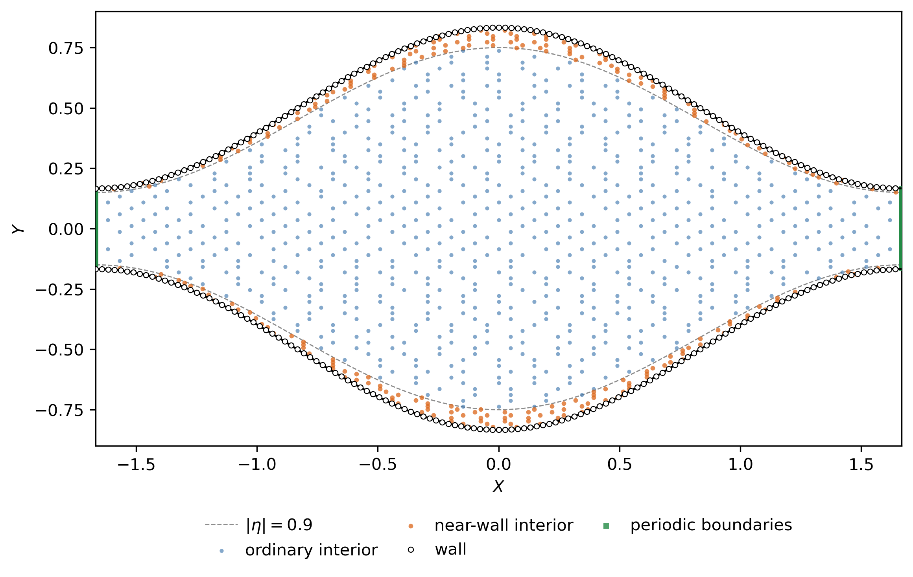
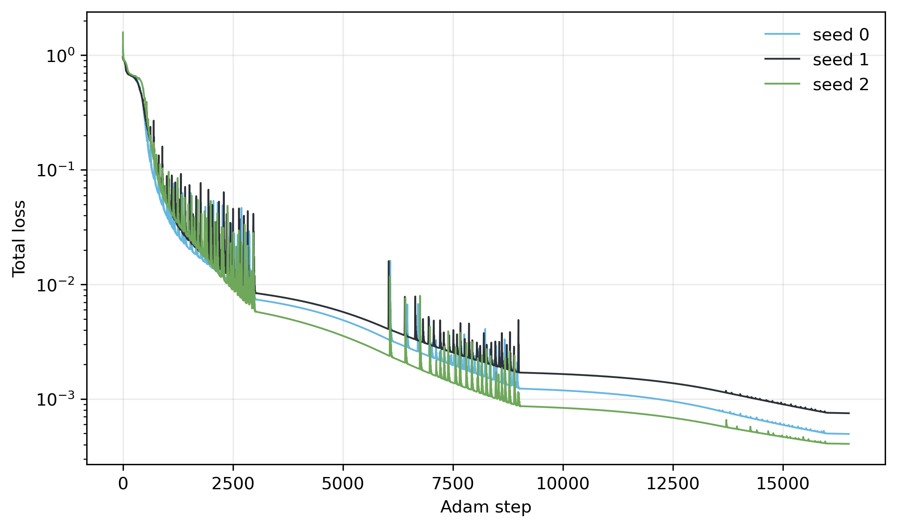
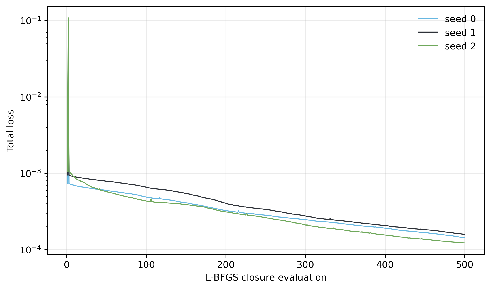

# Physics-informed neural network

The physics-informed neural network solves the same $Re=0$ periodic
corrugated-channel Stokes problem defined in [Physical problem](01_problem.md).
Training is physics-only: no FEM field, analytical field, target flux, or
supervised data enters the loss. FEM is used only in independent post-training
validation.

## Scaled coordinates

Introduce the centred physical coordinate

$$
x_c=x_{\mathrm{FEM}}-\frac{L}{2}.
$$

The dimensionless coordinates and period are

$$
X=\frac{x_c}{H_0},
\qquad
Y=\frac{y}{H_0},
\qquad
\ell=\frac{L}{H_0}.
$$

Define the mean full height and sinusoidal amplitude by

$$
H_0=\frac{\Delta\Omega+\Delta\omega}{2},
\qquad
A=\frac{\Delta\Omega-\Delta\omega}{2},
\qquad
a=\frac{A}{H_0}.
$$

The PINN relative amplitude $a=A/H_0$ is distinct from the physical
corrugation parameter $\varepsilon=(\Delta\Omega-\Delta\omega)/L$; for the
target case, $a=2/3$ whereas $\varepsilon=0.4$.

The dimensionless full channel height is

$$
h(X)=1+a\cos\left(\frac{2\pi X}{\ell}\right),
$$

and the walls are

$$
Y_\pm(X)=\pm\frac{h(X)}{2}.
$$

This is the centred PINN representation. The maximum width is at $X=0$ and
the minimum width is at $X=\pm\ell/2$. Its exact relation to the FEM cell is

$$
x_{\mathrm{FEM}}=H_0X+\frac{L}{2}.
$$

## Scaling

For nondimensionalization, the PINN uses the leading-order lubrication result
derived in [Analytical approximation](02_analytical.md). For the sinusoidal
channel, the dimensionless lubrication geometry factor is

$$
F=\frac{2+a^2}{2(1-a^2)^{5/2}}.
$$

The corresponding lubrication flux is used only as the characteristic flux
scale, not as supervised training data:

$$
Q_0=Q_{\mathrm{lub}}=\frac{G H_0^3}{12\mu F}.
$$

The velocity and pressure scales are

$$
U_0=\frac{Q_0}{H_0},
\qquad
P_0=G H_0,
$$

and the dimensionless viscous coefficient is

$$
\alpha=
\frac{\mu Q_0}{G H_0^3}
=
\frac{1}{12F}.
$$

The dimensionless fields are

$$
\Psi=\frac{\psi}{Q_0},
\qquad
U=\frac{u}{U_0},
\qquad
V=\frac{v}{U_0},
\qquad
\Pi=\frac{\widetilde p}{P_0}.
$$

For the final target case, the derived values are:

| Quantity | Value |
|---|---:|
| $H_0$ | $0.3$ |
| $A$ | $0.2$ |
| $a$ | $2/3$ |
| $\ell$ | $10/3$ |
| $F$ | $5.31290$ |
| $Q_0$ | $4.23498\times10^{-4}$ |
| $U_0$ | $1.41166\times10^{-3}$ |
| $P_0$ | $0.3$ |
| $\alpha$ | $1.56851\times10^{-2}$ |

## Network representation

The network takes $(X,Y)$ as inputs and returns $(\Psi,\Pi)$:

$$
(\Psi,\Pi)=\mathcal N_\theta(X,Y).
$$

Here $\mathcal N_\theta$ denotes the neural network and $\theta$ denotes its
trainable parameters.

It has four hidden layers of width $100$, with $\tanh$ activation, no output
activation, and `torch.float64` parameters on the CPU. Weights use
Xavier-normal initialization and biases are zero. Three independent runs use
seeds $0$, $1$, and $2$. The seed determines the Xavier-normal initialization
of the network weights; the architecture, collocation points, and optimization
protocol are otherwise identical. Each run is deterministic once its seed is
fixed.

The dimensionless velocity components are obtained from the streamfunction by
automatic differentiation:

$$
U=\frac{\partial\Psi}{\partial Y},
\qquad
V=-\frac{\partial\Psi}{\partial X}.
$$

This representation makes incompressibility structurally satisfied up to
automatic-differentiation roundoff. The continuity residual is nevertheless
retained as one of the eight monitored and trained loss terms.

## Dimensionless Stokes residuals

The dimensionless residuals are

$$
R_x
=
1-\frac{\partial\Pi}{\partial X}
+
\alpha
\left(
\frac{\partial^2 U}{\partial X^2}
+
\frac{\partial^2 U}{\partial Y^2}
\right),
$$

$$
R_y
=
-\frac{\partial\Pi}{\partial Y}
+
\alpha
\left(
\frac{\partial^2 V}{\partial X^2}
+
\frac{\partial^2 V}{\partial Y^2}
\right),
$$

$$
R_c
=
\frac{\partial U}{\partial X}
+
\frac{\partial V}{\partial Y}.
$$

$R_x$ and $R_y$ are the residuals of the $x$- and $y$-momentum Stokes
equations, respectively, while $R_c$ is the continuity, or incompressibility,
residual.

All required derivatives are obtained by automatic differentiation.

## Physics-informed objective

The objective is the unweighted sum of exactly eight mean-square terms:

$$
\mathcal L
=
\mathcal L_x
+\mathcal L_y
+\mathcal L_c
+\mathcal L_{\mathrm{wall},U}
+\mathcal L_{\mathrm{wall},V}
+\mathcal L_{\mathrm{per},U}
+\mathcal L_{\mathrm{per},V}
+\mathcal L_{\mathrm{per},\Pi}.
$$

The three field-equation terms are

$$
\mathcal L_x=\operatorname{MSE}(R_x),
\qquad
\mathcal L_y=\operatorname{MSE}(R_y),
\qquad
\mathcal L_c=\operatorname{MSE}(R_c).
$$

No slip is imposed weakly on both channel walls through

$$
\mathcal L_{\mathrm{wall},U}=\operatorname{MSE}(U),
\qquad
\mathcal L_{\mathrm{wall},V}=\operatorname{MSE}(V).
$$

Periodicity is imposed through corresponding left and right points:

$$
\mathcal L_{\mathrm{per},U}
=
\operatorname{MSE}
\left[
U(-\ell/2,Y)-U(+\ell/2,Y)
\right],
$$

$$
\mathcal L_{\mathrm{per},V}
=
\operatorname{MSE}
\left[
V(-\ell/2,Y)-V(+\ell/2,Y)
\right],
$$

$$
\mathcal L_{\mathrm{per},\Pi}
=
\operatorname{MSE}
\left[
\Pi(-\ell/2,Y)-\Pi(+\ell/2,Y)
\right].
$$

For simplicity, periodicity is imposed softly by matching $U$, $V$, and the periodic pressure
correction $\Pi$ at corresponding points on the two periodic boundaries.
Derivative periodicity is not enforced explicitly.

All eight weights equal $1$. There is no adaptive loss weighting, FEM or
analytical supervision, target-flux loss, or pressure-gauge target in
training.

## Deterministic collocation

Training uses fixed collocation points at which the governing equations and
boundary conditions are enforced through the loss. Three point types are used:

- interior points, where the Stokes residuals $R_x$, $R_y$, and $R_c$ are
  evaluated;
- wall points, where the no-slip conditions $U=V=0$ are enforced;
- corresponding left/right periodic point pairs, where $U$, $V$, and $\Pi$ are
  matched.

Adam and L-BFGS use separate deterministic collocation sets, with a denser set
for L-BFGS. Neither set is randomly resampled during optimization.

The interior set is further divided into ordinary interior points and a
near-wall subset. To provide additional resolution near the curved walls,
$25\%$ of the interior points are assigned to a thin near-wall band. Define

$$
\eta=\frac{2Y}{h(X)}.
$$

$|\eta|=1$ corresponds to the walls. The criterion

$$
|\eta|>0.9
$$

selects the outer $5\%$ of the full local channel width adjacent to each wall.

The ordinary and near-wall points are selected from two structured $n\times n$
candidate grids; the near-wall candidate grid is denser to provide additional
resolution in that region.

| Stage | Interior | Ordinary interior | Near-wall interior | Wall points total | Periodic pairs | Ordinary candidate-grid $n$ | Near-wall candidate-grid $n$ |
|:---:|---:|---:|---:|---:|---:|---:|---:|
| Adam | 1024 | 768 | 256 | 256 | 128 | 68 | 136 |
| L-BFGS | 4096 | 3072 | 1024 | 1024 | 512 | 136 | 272 |

Wall totals include both walls. Periodic entries are corresponding left/right
pairs. Candidate coordinates are deterministic and endpoint-excluded where
required. Ordered candidate arrays of length $N$ are reduced to $n$ points
using exactly

$$
i_k=
\left\lfloor
\frac{kN}{n}
\right\rfloor,
\qquad
k=0,\ldots,n-1,
$$

equivalent to the implementation
`floor(linspace(0, N, count, endpoint=False)).astype(int)`. There is no random
sampling, Latin hypercube sampling, optimization-time resampling, or adaptive
collocation.

  
   
  <em>Deterministic Adam collocation set.</em>

## Optimization

Training follows a common PINN strategy: Adam first provides robust first-order
optimization from the initialized network, followed by L-BFGS for deterministic
quasi-Newton refinement.

### Adam

Adam is full-batch on the fixed Adam collocation set for exactly $16500$
steps.

| Steps | Learning rate |
|:---:|---:|
| 1–3000 | $5\times10^{-4}$ |
| 3001–9000 | $10^{-4}$ |
| 9001–16000 | $10^{-5}$ |
| 16001–16500 | $10^{-6}$ |

Deterministic recovery checkpoints make the long run resumable without
changing the scientific protocol.

  
   
  <em>Total Adam loss histories for the three initialization seeds.</em>

The figure uses neither smoothing nor a fitted trend line.

### L-BFGS

After Adam, one fresh L-BFGS optimizer is run on the independently regenerated
refined deterministic point set. Its controls are:

| Control | Value |
|---|---:|
| Learning rate | $1$ |
| History size | $100$ |
| Line search | `strong_wolfe` |
| Gradient tolerance | $10^{-12}$ |
| Change tolerance | $10^{-14}$ |
| Maximum closure evaluations | $500$ |

The completed runs reached the fixed $500$-closure evaluation cap; this is not
described as tolerance convergence.

  
   
  <em>Total L-BFGS loss histories for the three initialization seeds.</em>

The L-BFGS history figure uses no smoothing.

## Completed training runs

The final losses below were read from the completed training results.

| Seed | Final Adam loss | Final L-BFGS loss |
|:---:|---:|---:|
| 0 | $4.95802\times10^{-4}$ | $1.43132\times10^{-4}$ |
| 1 | $7.51894\times10^{-4}$ | $1.58530\times10^{-4}$ |
| 2 | $4.06461\times10^{-4}$ | $1.22300\times10^{-4}$ |

On the Linux CPU used for the final reproduction, a complete training run took
roughly one hour per seed (exact wall-clock times are stored in the corresponding `results/pinn/seed_N/training.json` files). Wall-clock time is platform-, hardware-, threading-,
and software-stack-dependent, so this is only an approximate guide.

All three runs use the identical scientific protocol apart from the
initialization seed. Seed $1$ is the preselected representative run for the
field comparisons in [Post-training validation](05_validation.md); it was not
selected because it has the best validation error.

## Training outputs and separation from validation

The three completed training runs are stored under `results/pinn/seed_N/` for
$N=0,1,2$. In each directory, `model.pt` stores the trained checkpoint and
`training.json` stores the corresponding scientific protocol, optimizer
histories, counts, timings, and final losses. The separate validation workflow
produces `validation.json` without modifying the trained model. Optimization
never reads FEM data. Validation results are documented separately in
[Post-training validation](05_validation.md).
