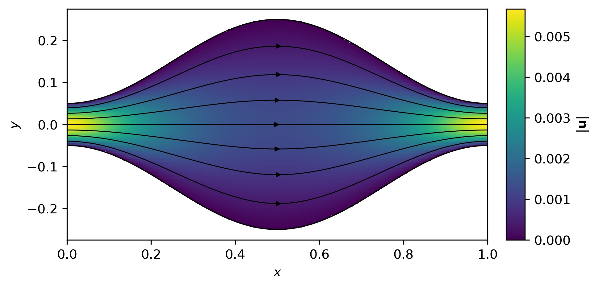
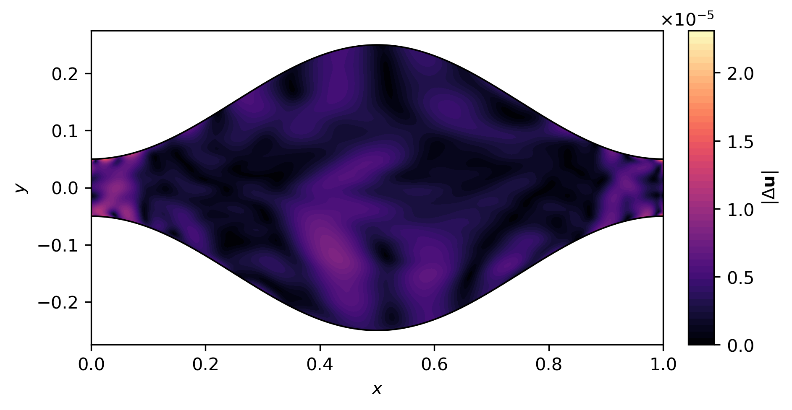
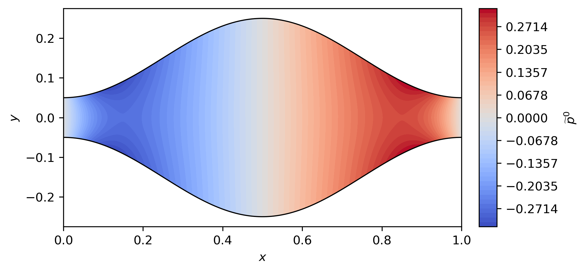
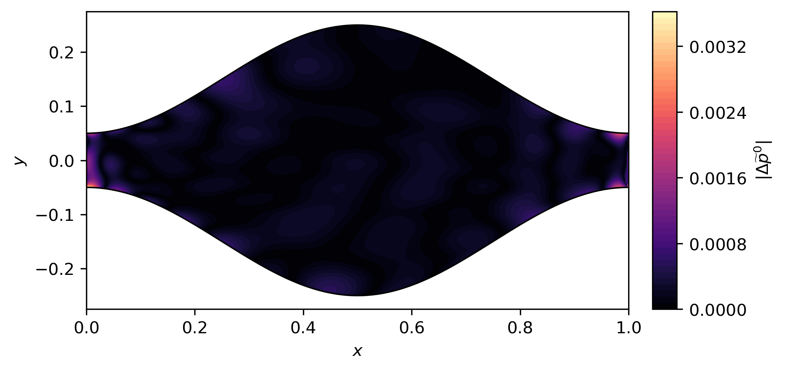
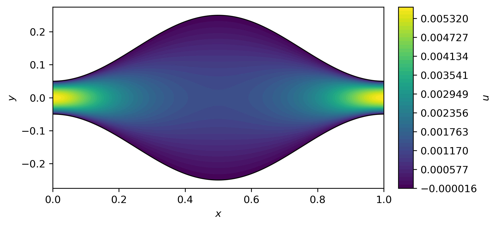
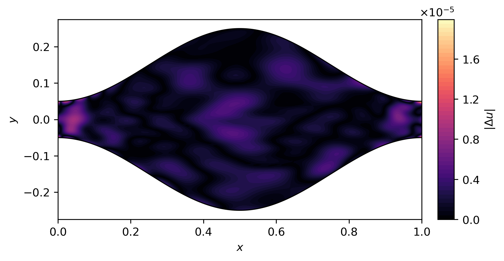
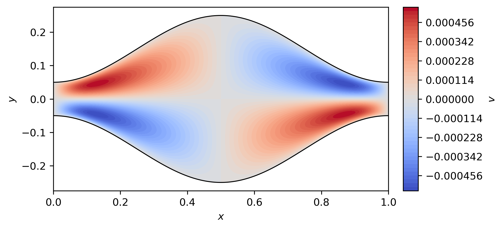
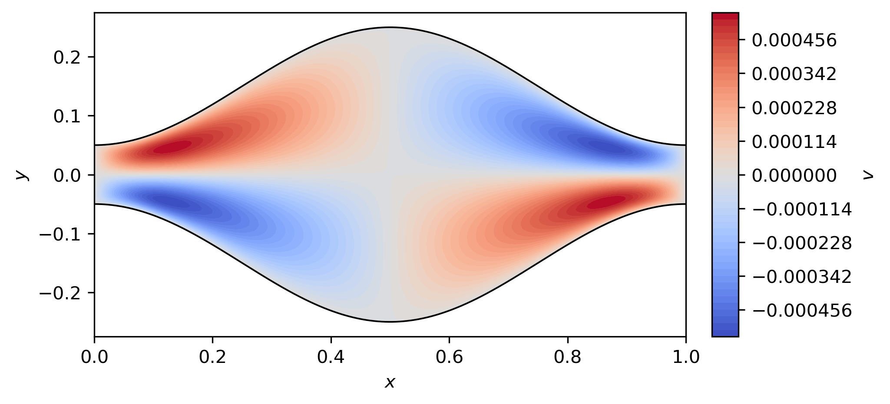
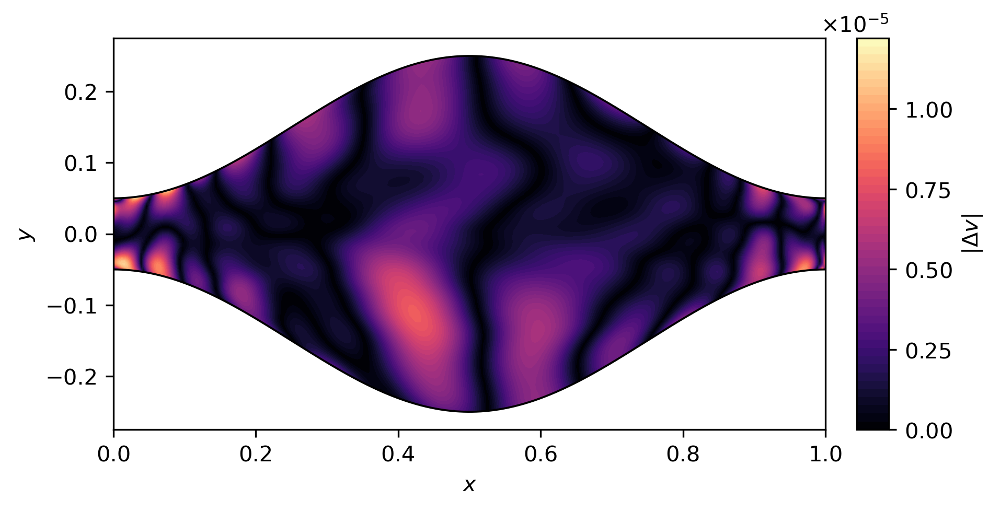

# Post-training validation

PINN training is physics-only: no FEM field, analytical field, target flux, or
supervised solution data enters the loss. The completed networks are first
examined through independent a-posteriori physics diagnostics and are then
compared with the independently computed [FEM reference](03_fem.md). These are two
distinct forms of evidence. The residual, wall, periodicity, and flux values
are numerical diagnostics, not rigorous a-posteriori bounds on solution error.
The PINN formulation and training protocol are documented separately in
[Physics-informed neural network](04_pinn.md).

For each seed $N=0,1,2$, `results/pinn/seed_N/validation.json` stores the
PINN-only a-posteriori diagnostics and independent FEM-comparison metrics.

## Coordinate and field alignment

The PINN uses centred scaled coordinates $(X,Y)$, whereas the FEM cell uses
physical coordinates $(x_{\mathrm{FEM}},y_{\mathrm{FEM}})$. They are aligned by

$$
x_{\mathrm{FEM}}=H_0X+\frac{L}{2},
\qquad
y_{\mathrm{FEM}}=H_0Y.
$$

The dimensionless PINN fields are reconstructed in physical units as

$$
u_{\mathrm{PINN}}=U_0U,
\qquad
v_{\mathrm{PINN}}=U_0V,
\qquad
\widetilde p_{\mathrm{PINN}}=P_0\Pi.
$$

The velocity and pressure discrepancies are based on physical $L^2$-type field
norms over the channel area. For example, the squared velocity-field
difference is measured through

$$
\int_\Omega
\left[
\left(u_{\mathrm{PINN}}-u_{\mathrm{FEM}}\right)^2
+
\left(v_{\mathrm{PINN}}-v_{\mathrm{FEM}}\right)^2
\right]dA,
$$

and is normalized by the corresponding FEM velocity-field norm. The numerical
comparison grid and its weights are used only to evaluate these physical-area
integrals numerically.

The comparison uses $n_x=257$ longitudinal points uniformly spaced in $x$ over
one period. The periodic endpoint $x=L$ is omitted because it duplicates
$x=0$, so the longitudinal spacing is

$$
\Delta x=\frac{L}{n_x}=\frac{L}{257}.
$$

The normalized transverse coordinate $\eta\in[-1,1]$, introduced in
[Physics-informed neural network](04_pinn.md), represents position across a
local channel section: $\eta=-1$ is the lower wall and $\eta=+1$ is the upper
wall. For the FEM–PINN comparison, the same coordinate is mapped between the
discrete FEM lower and upper wall positions. At $x_i$, define

$$
H_i=y_+(x_i)-y_-(x_i),
$$

so that a transverse point $\eta_j$ maps to

$$
y_{ij}=y_-(x_i)+\frac{\eta_j+1}{2}H_i.
$$

The $96$ transverse values $\eta_j$ are nonuniformly spaced Gauss–Legendre
nodes on $[-1,1]$. Gauss–Legendre quadrature is a standard numerical
integration rule on this interval: each node has a prescribed weight $w_j$, and

$$
\int_{-1}^{1}g(\eta)\,d\eta
\approx
\sum_j w_j g(\eta_j).
$$

Here it is used only to evaluate the transverse part of the physical-area
integrals. It is not part of the physics, the PINN formulation, or the FEM
discretization itself.

The uniform longitudinal direction contributes the interval length
$\Delta x=L/n_x$, while mapping $\eta\in[-1,1]$ to the physical cross-section
contributes the Jacobian

$$
dy=\frac{H_i}{2}\,d\eta.
$$

Combining these factors with the Gauss–Legendre weight gives

$$
W_{ij}=w_j\frac{H_i}{2}\frac{L}{n_x}.
$$

$W_{ij}$ is the numerical physical-area weight associated with the sample
point $(x_i,y_{ij})$. These weights are needed because the field discrepancy
approximates an integral over the physical channel area, not an unweighted
arithmetic average over numerical sample points. All field norms below use
these weights.

Incompressible Stokes pressure is defined only up to an arbitrary additive
constant. FEM and PINN pressures therefore cannot be compared directly until a
common gauge is chosen. The chosen gauge is zero physical-area mean pressure,
so each sampled pressure field is converted independently to

$$
\widetilde p^0
=
\widetilde p
-
\frac{\sum_{ij}W_{ij}\widetilde p_{ij}}
     {\sum_{ij}W_{ij}}.
$$

The weighting is required because this is the mean over physical channel area,
not the arithmetic mean over the nonuniform quadrature points.

## A-posteriori PINN diagnostics

The momentum residuals below are evaluated on an independent deterministic
$8192$-point diagnostic set that was not used during training; the calculation
uses physical-width weighting. Wall diagnostics use $4096$ points,
periodicity uses $2049$ corresponding point pairs, and flux conservation uses
$513$ longitudinal sections with $64$-point Gauss–Legendre quadrature.
Relative flux variation is $(\max Q-\min Q)/|\overline Q|$.

| Seed | $R_x$ RMS | $R_y$ RMS | Wall speed RMS / $U_0$ | Relative flux variation |
|:---:|---:|---:|---:|---:|
| 0 | $1.04\times10^{-2}$ | $6.84\times10^{-3}$ | $3.99\times10^{-3}$ | $1.97\times10^{-3}$ |
| 1 | $1.10\times10^{-2}$ | $7.12\times10^{-3}$ | $3.80\times10^{-3}$ | $1.96\times10^{-3}$ |
| 2 | $1.02\times10^{-2}$ | $7.45\times10^{-3}$ | $3.43\times10^{-3}$ | $1.12\times10^{-3}$ |

| Seed | Periodic $U$ RMS | Periodic $V$ RMS | Periodic $\Pi$ RMS | Continuity RMS |
|:---:|---:|---:|---:|---:|
| 0 | $6.15\times10^{-4}$ | $2.98\times10^{-3}$ | $3.14\times10^{-3}$ | $1.59\times10^{-15}$ |
| 1 | $9.09\times10^{-4}$ | $2.60\times10^{-3}$ | $2.98\times10^{-3}$ | $1.73\times10^{-15}$ |
| 2 | $7.75\times10^{-4}$ | $2.29\times10^{-3}$ | $2.70\times10^{-3}$ | $1.44\times10^{-15}$ |

The continuity, or incompressibility, residual remains at approximately
$10^{-15}$, i.e. at automatic-differentiation and floating-point roundoff,
because incompressibility is structurally enforced by the streamfunction
representation.

Across the three seeds, the independent momentum residuals are of order
$10^{-2}$, wall-speed RMS errors are only a few parts in $10^3$ of $U_0$,
relative flux variation is of order $10^{-3}$, and periodicity discrepancies
are of order $10^{-3}$ or smaller. These quantities are consistency
diagnostics, not rigorous a-posteriori solution-error bounds.

## Independent FEM–PINN comparison

With

$$
\|f\|_W
=
\left(\sum_{ij}W_{ij}|f_{ij}|^2\right)^{1/2},
$$

the reported velocity discrepancy is

$$
e_u
=
\frac{\|\mathbf u_{\mathrm{PINN}}-\mathbf u_{\mathrm{FEM}}\|_W}
     {\|\mathbf u_{\mathrm{FEM}}\|_W},
$$

the pressure discrepancy is

$$
e_p
=
\frac{\|\widetilde p^0_{\mathrm{PINN}}-\widetilde p^0_{\mathrm{FEM}}\|_W}
     {\|\widetilde p^0_{\mathrm{FEM}}\|_W},
$$

and the mean-flux discrepancy is

$$
e_Q
=
\frac{|\overline Q_{\mathrm{PINN}}-\overline Q_{\mathrm{FEM}}|}
     {|\overline Q_{\mathrm{FEM}}|}.
$$

The PINN mean flux in this comparison uses $257$ longitudinal sections and
$64$-point transverse Gauss–Legendre quadrature. The FEM value is the stored
mean-flux diagnostic from the selected $256\times128$ reference.

| Seed | Velocity discrepancy $e_u$ | Zero-mean pressure discrepancy $e_p$ | Mean-flux discrepancy $e_Q$ |
|:---:|---:|---:|---:|
| 0 | $0.266\%$ | $0.129\%$ | $0.105\%$ |
| 1 | $0.213\%$ | $0.130\%$ | $0.070\%$ |
| 2 | $0.295\%$ | $0.156\%$ | $0.056\%$ |

These FEM–PINN discrepancies quantify agreement with the selected
$256\times128$ FEM reference; they are not rigorous continuum-error estimates.

The three-seed mean $\pm$ population standard deviation is
$0.258\%\pm0.034\%$ for velocity, $0.138\%\pm0.013\%$ for zero-mean
pressure, and $0.077\%\pm0.020\%$ for mean flux. Seeds $0$, $1$, and $2$
are the complete reported ensemble.

These compact three-seed scalar results are consolidated in
`results/summary.json`.

The selected $256\times128$ FEM reference mean physical flux is
$3.85231\times10^{-4}$. The corresponding PINN
mean physical fluxes are $3.84827\times10^{-4}$ for seed $0$,
$3.84961\times10^{-4}$ for seed $1$, and $3.85015\times10^{-4}$ for seed $2$.

Across all three seeds, the velocity discrepancy is roughly $0.21\%$ to
$0.29\%$, the zero-mean pressure discrepancy is roughly $0.13\%$ to $0.16\%$,
and the mean-flux discrepancy is roughly $0.06\%$ to $0.10\%$. The maximum
velocity discrepancy is approximately $0.295\%$, so every seed remains below
$0.3\%$. The small
spread between seeds shows that this level of agreement is reproducible
across the three independent initializations.

## Representative field comparisons

Seed $1$ is the preselected representative realization for the field
comparisons below. This choice was made before the benchmark errors were
inspected. All panels use the same established physical comparison grid and
coordinate alignment as the numerical benchmark above.

The panels are generated from the verified seed-1 checkpoint
`results/pinn/seed_1/model.pt` and the stored FEM field grid
`results/fem/reference.npz`; field arrays are not stored in
`validation.json`.

<table>
  <tr>
    <td width="33.33%" align="center"><b>FEM</b></td>
    <td width="33.33%" align="center"><b>PINN seed 1</b></td>
    <td width="33.33%" align="center"><b>Difference</b></td>
  </tr>
  <tr>
    <td colspan="3" align="center"><b>Velocity magnitude and streamlines</b></td>
  </tr>
  <tr>
    <td align="center">
      
    </td>
    <td align="center">
      
    </td>
    <td align="center">
      
    </td>
  </tr>
  <tr>
    <td colspan="3" align="center"><b>Zero-mean pressure</b></td>
  </tr>
  <tr>
    <td align="center">
      
    </td>
    <td align="center">
      
    </td>
    <td align="center">
      
    </td>
  </tr>
</table>

The speed panels show the full velocity field through magnitude and
streamlines, while the difference panel shows the vector-error magnitude.
The pressure row compares the independently weighted zero-mean representatives
before taking the pointwise error magnitude.

### Velocity-component comparison

<table>
  <tr>
    <td width="33.33%" align="center"><b>FEM</b></td>
    <td width="33.33%" align="center"><b>PINN seed 1</b></td>
    <td width="33.33%" align="center"><b>Difference</b></td>
  </tr>
  <tr>
    <td colspan="3" align="center"><b>Longitudinal velocity <i>u</i></b></td>
  </tr>
  <tr>
    <td align="center">
      
    </td>
    <td align="center">
      
    </td>
    <td align="center">
      
    </td>
  </tr>
  <tr>
    <td colspan="3" align="center"><b>Transverse velocity <i>v</i></b></td>
  </tr>
  <tr>
    <td align="center">
      
    </td>
    <td align="center">
      
    </td>
    <td align="center">
      
    </td>
  </tr>
</table>

The component panels expose the signed longitudinal and transverse structure
separately. This is useful even though $e_u$ already measures the full vector
field, because it makes the location and component origin of the vector
discrepancy directly visible.

## Overall validation conclusion

The trained PINNs satisfy the governing equations and constraints on
diagnostic points that were not used during training. They independently
reproduce the selected $256\times128$ FEM reference at the $10^{-3}$ level in
velocity and zero-mean pressure, with the mean-flux discrepancy of order $10^{-3}$.
FEM fields were never used during PINN
training, so this comparison is an independent benchmark rather than
supervision.
